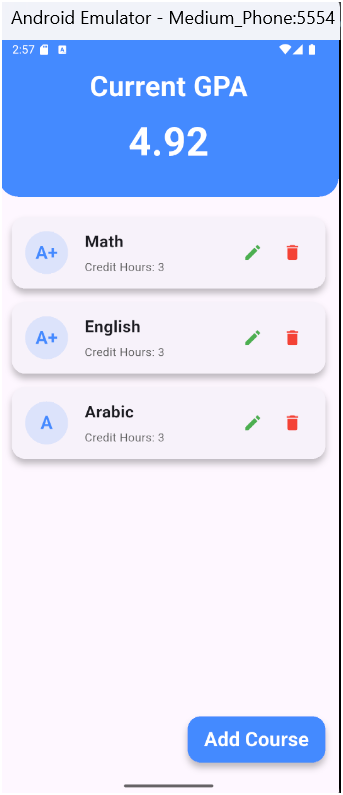
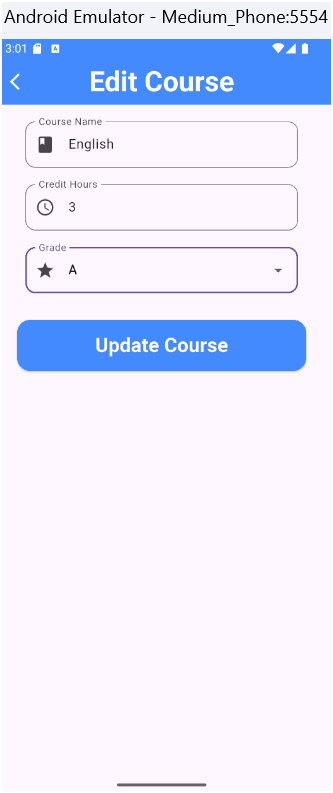

# 📘 GPA Calculator App

# Project Description

The GPA Calculator App designed to help students manage their courses and calculate their Grade Point Average (GPA) efficiently. The app provides a user-friendly interface for adding, editing, and deleting courses, while dynamically calculating the GPA based on the entered data.

## Features

Course Management: Users can add new courses, edit existing ones, and delete courses they no longer need.
GPA Calculation: Automatically calculates the GPA based on the courses and their respective grades and credit hours.
User Interface: Intuitive and responsive design utilizing Flutter's Material Design components, ensuring a smooth user experience.
State Management: Implements the BLoC (Business Logic Component) pattern for managing the application state effectively.

## Components

Course Model: Represents a course with attributes like name, grade, and credit hours.
Course State: Manages the list of courses and calculates the GPA.
Course Events: Defines actions related to course management (add, update, delete).
Course BLoC: Handles the business logic for processing course events and updating the state.

## UI Screens:
Home Screen: Displays the current GPA and lists all courses.
Add/Edit Course Screen: Form to add a new course or edit an existing one.

## Technologies Used
Flutter: For building the mobile application.
Dart: Programming language used for application development.
BLoC: For state management.

## Target Audience
The app is targeted at students who wish to keep track of their academic performance and GPA in an organized manner.

## ⚙️ Setup Instructions

Clone the repository: Use the command line: git clone <Your Repository Path>

Install dependencies: Make sure you have Flutter installed. Then run: flutter pub get

Run the app: You can launch the app using: flutter run

Note: You need a working emulator or a connected real device

# 📱Screen Design Overview

# Home Screen

# Add Edit Course Screen 
# Add Course Screen 

# Edit Course Screen

