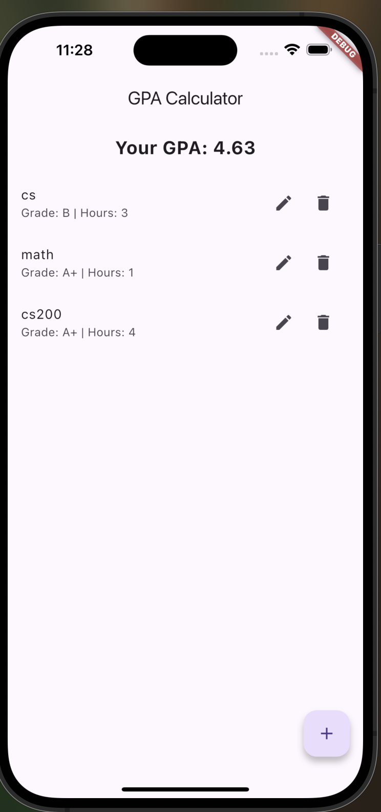
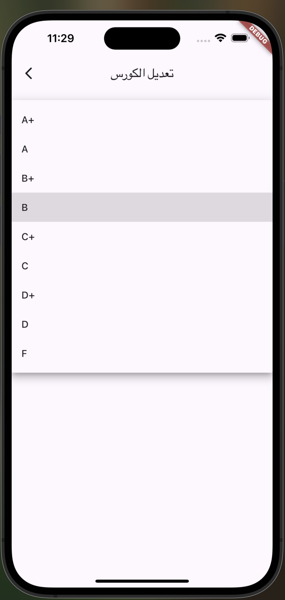
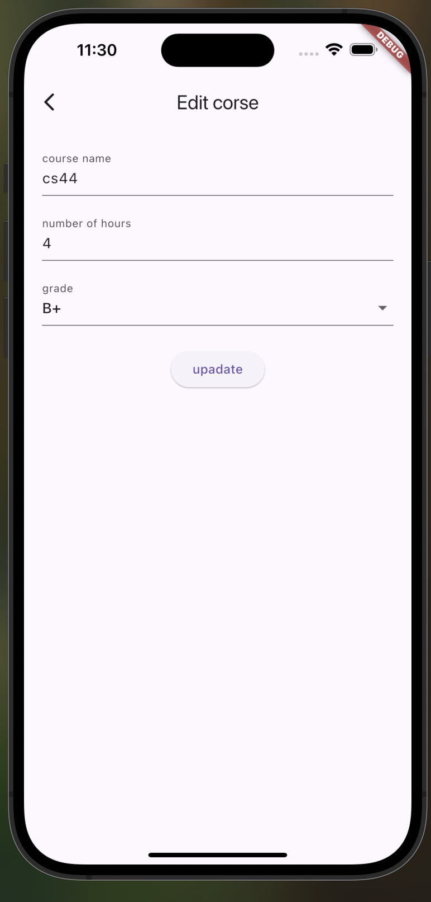

# 📊 GPA Calculator App

A simple academic GPA calculator built using **Flutter** and **BLoC** pattern.  
This app allows students to manage their course grades and credit hours and calculates their GPA dynamically.

---

## 🖼️ Screenshots

<div align="center">
  
  
  
  
</div>

---

## 🚀 App Features

### 📄 Homepage
- View all added courses with their grade and credit hours.
- See real-time calculated GPA.
- Tap a course to edit it.
- Delete courses instantly.
- Built with **BLoC** for robust state management.

### ➕ Add/Edit Course Screen
- Enter course name.
- Choose grade from dropdown (A+, A, B+, etc.).
- Enter credit hours (validated as a number).
- Supports form validation.
- Allows editing and deleting courses.

---

## 🛠️ Built With

- **Flutter**
- **Dart**
- **flutter_bloc**
- **Material Design**

---

## ▶️ Getting Started

1. **Clone the repo:**
   ```bash
   git clone https://github.com/your-username/gpa_calculator.git
   cd gpa_calculator
Install dependencies:
flutter pub get
Run the app:
flutter run

 Author

Created by manaalq
GitHub: @manaalq
