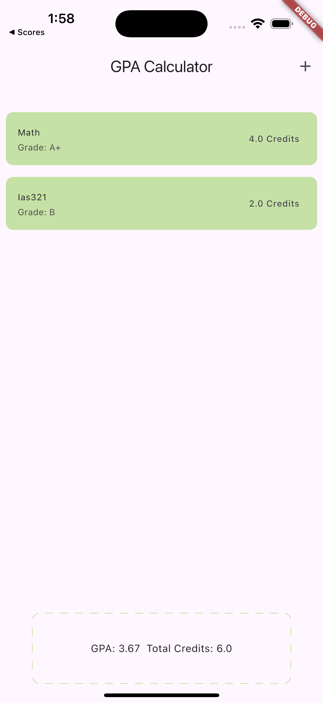
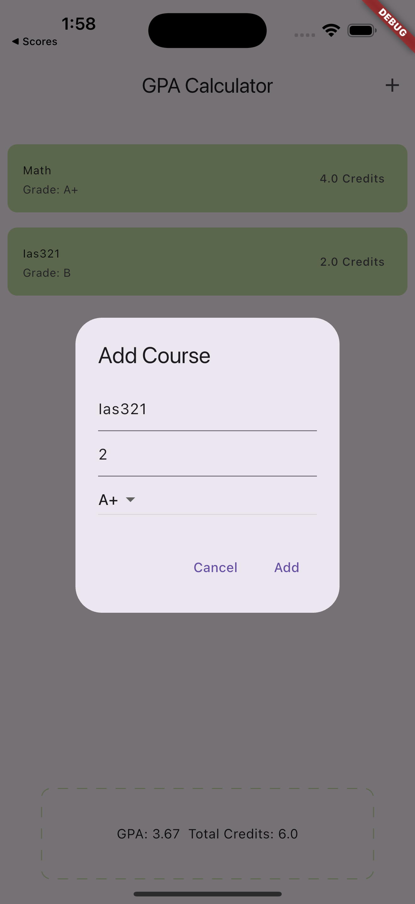
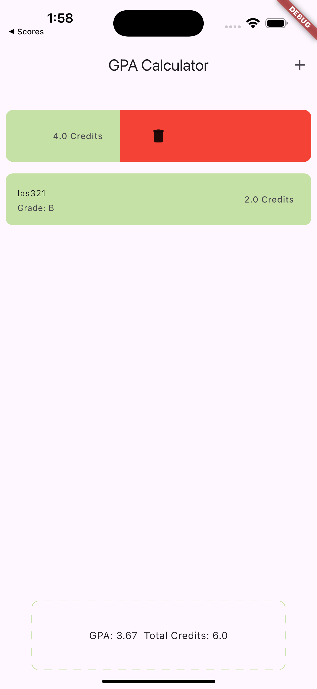

## Simple Flutter GPA Calculator

A lightweight Flutter application that allows you to manage your academic courses and calculate your GPA in real time. You can add, edit, or delete courses seamlessly using BLoC for state management. The UI features a dashed border around the GPA and total credits summary using the `mobkit_dashed_border` package.

## Screenshots

### Home Screen



### Add Course Dialog



### Edit Course Dialog


### Delete Course (Dismissible)



## Features

* **Add Courses**
  Tap the **+** button in the app bar to open a dialog for adding a new course (course name, credit hours, grade).

* **Edit Courses**
  Tap a course list tile to open a dialog pre-filled with its details for editing.

* **Delete Courses**
  Swipe a course entry to the left or right to delete it using Flutter's `Dismissible` widget.

* **Real-time GPA Calculation**
  Displays your calculated GPA and total credits with a sleek dashed border provided by the `mobkit_dashed_border` package.

* **BLoC State Management**
  Built with the BLoC pattern for clear separation of UI and business logic, ensuring maintainability and testability.

* **Course Model**
  Uses a `Course` data model class to encapsulate course properties and facilitate state updates.

## Tech Stack

* **Flutter** (>=3.0.0)
* **Dart**
* **flutter\_bloc** for state management
* **mobkit\_dashed\_border** for dashed UI borders

## Installation

1. **Clone the repository**

   ```bash
   git clone https://github.com/your-username/flutter-gpa-calculator.git
   ```
2. **Change into project directory**

   ```bash
   cd flutter-gpa-calculator
   ```
3. **Install dependencies**

   ```bash
   flutter pub get
   ```
4. **Run the app**

   ```bash
   flutter run
   ```

## How to Use

1. **View Courses**
   The home screen lists all your added courses, showing course name, credits, and grade.

2. **Add a Course**

   * Tap the **+** icon in the top-right corner.
   * Fill in the course details in the dialog.
   * Tap **Save** to add the course to the list and recalculate GPA.

3. **Edit a Course**

   * Tap on an existing course list tile.
   * Modify any details in the dialog.
   * Tap **Update** to apply changes and refresh GPA.

4. **Delete a Course**

   * Swipe a course entry left or right.
   * The course is removed instantly and the GPA is updated.

## Author

**Solaiman Al-Dokhail**
Software Engineering Student

---

Happy calculating! 🎓
