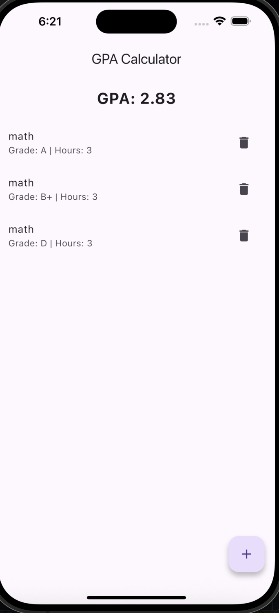
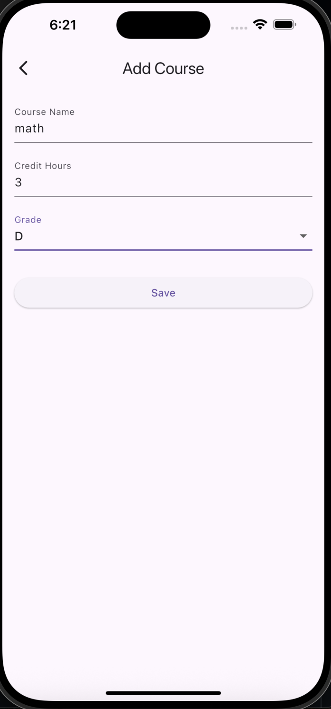

# 📊 GPA Calculator App 🎓

A Flutter app that helps students calculate their academic GPA dynamically based on course grades and credit hours — powered by BLoC for state management and built using custom Flutter widgets.

---

## 🔹 What’s in the app:

- 🏠 Home screen with GPA display
- ➕ Add new courses with name, grade & hours
- 📋 View all added courses
- ♻️ Edit & delete course functionality
- ⬇️ Grade dropdown with options (A, B+, C...)
- 🧠 Built with BLoC for state management
- 🎨 Fully custom UI layout (no packages used)

---

## 🖼️ Screenshots

| Home | Add Course |
|:--:|:--:|
|  |  |

---

## 🚀 How to Run

1. Clone the repo:
   ```bash
   git clone https://github.com/Ameerah077/GPA-Calculator.git
2. Navigate to the project folder:
cd gpa_app
3. Get dependencies:
flutter pub get
4. Run the app:
flutter run


## 👩‍💻 Author
Ameerah Aloufi

