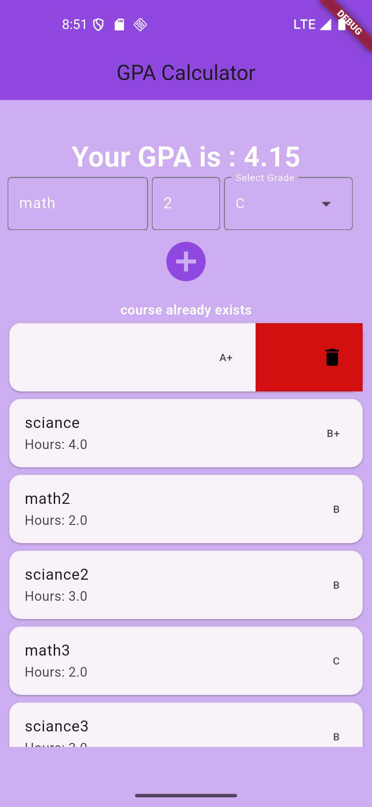

# GPA Calculator📈
- A Beautiful app for calculating GPA
---
## Screenshot





---
## Tech Stack
- Flutter
- Dart
---
## Installation
1. Clone the repository:
```bash
git clone https://github.com/Ahmed-Almansour99/GPA-Calculator.git

cd GPA-Calculator

cd gpa_calculator

flutter pub get

flutter run
```
## Author

github : Ahmed-Almansour99
 

